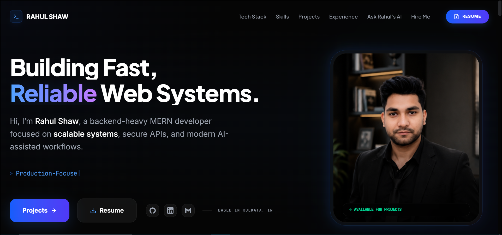

# 🌌 Rahul Shaw | AI-First Cinematic Portfolio

[](https://nextjs.org/)
[](https://react.dev/)
[](https://tailwindcss.com/)
[](https://deepmind.google/technologies/gemini/)

> **A high-performance, cinematic digital experience engineered with a focus on AI integration, backend-heavy architecture, and premium visual storytelling.**

---

## 📸 Visual Showcase

### 🌠 Cinematic Hero


### 🖥️ Full Desktop Experience


---

## 🤖 AI-Centric Features

### 🧠 Gemini-Powered Recruiter Assistant
Integrated with **Gemini 2.5 Flash**, the portfolio features a custom-built AI agent designed to evaluate technical depth, project impact, and professional alignment in real-time. It provides recruiters with an interactive, on-demand verification layer.

### 🛡️ Production-Grade Intelligence
- **RAG-Ready Architecture**: Capable of ingesting dynamic project documentation for high-fidelity responses.
- **Secure AI Workflows**: Optimized prompt engineering with strict formatting controls for a clean, professional recruiter experience.
- **Real-Time Analysis**: Low-latency interaction cycles powered by Vercel edge edge functions and Next.js server components.

---

## 🚀 Core Engineering Highlights

- **Premium UI/UX**: Dark-mode primary design with custom glassmorphism effects, cinematic background gradients, and hardware-accelerated animations via **Framer Motion**.
- **Backend-Heavy MERN Stack**: Engineered for scalability, featuring secure REST APIs, role-based access logic (RBAC), and complex data relationships.
- **Next.js 16 & React 19**: Leveraging the cutting edge of the React ecosystem, including Server Components, advanced caching strategies, and the latest Turbopack performance.
- **Technical Milestone Timeline**: An interactive, scroll-synchronized professional evolution map that tracks engineering growth through high-fidelity visual nodes.
- **Responsive Mastery**: Fluid, break-point optimized engineering ensuring a "native app" feel across mobile, tablet, and ultra-wide displays.

---

## 🛠️ Technical Manifesto

### The Engine
- **Framework**: Next.js 16 (App Router)
- **Runtime**: Node.js & Bun
- **Language**: Strict-Mode TypeScript

### Aesthetics & Motion
- **Style Engine**: Tailwind CSS 4.0 (PostCSS 8)
- **Motion**: Framer Motion (motion/react)
- **Iconography**: Official Brand SVGs + Lucide React

### Artificial Intelligence
- **Model**: Google Gemini 2.5 Flash
- **Orchestration**: Google Generative AI SDK
- **Knowledge Base**: Upstash Vector (Optional RAG)

---

## 📂 Architecture

```text
src/
├── app/              # High-performance routes & API architecture
├── components/       # Component-driven UI modularity
│   ├── layout/       # Structural scaffolding (Navbar, Footer)
│   ├── sections/     # Premium feature blocks (Hero, AI Chat, Tech Stack)
│   └── shared/       # Highly reusable, atomic UI primitives
├── data/             # Decoupled content & knowledge repository
└── types.ts          # Centralized TypeScript contract definitions
```

---

## 🛠️ Local Development

### Installation

```bash
# Clone the repository
git clone https://github.com/CODER-RAHUL9038/rahulshaw-portfolio.git

# Navigate to project
cd rahulshaw-portfolio

# Install premium dependencies
npm install

# Configure Secrets (.env.local)
GEMINI_API_KEY=your_key_here
```

### Development Execution
```bash
npm run dev
```

---

## 🤝 Connect & Collaborate

**Rahul Shaw** - Full-Stack MERN & AI Systems Engineer
- **Live Demo**: [rahul-shaw-ai-portfolio.vercel.app](https://rahul-shaw-ai-portfolio.vercel.app/)
- **GitHub**: [@CODER-RAHUL9038](https://github.com/CODER-RAHUL9038)
- **LinkedIn**: [rahulshaw-dev](https://www.linkedin.com/in/rahulshaw-dev)
- **Email**: [rahulshaw903866@gmail.com](mailto:rahulshaw903866@gmail.com)

---
*Built with precision using the Next.js 16 + React 19 Cinematic Ecosystem.*
